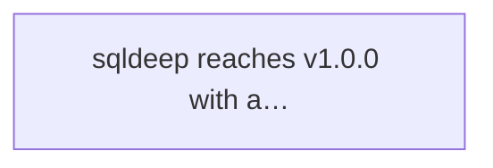

# Targets

## Active

### 🎯T1 sqldeep reaches v1.0.0 with all syntax and API surfaces declared stable
- **Weight**: 4 (value 13 / cost 3)
- **Estimated-cost**: 3
- **Acceptance**:
  - All items in STABILITY.md are marked Stable (no Experimental or Needs review remaining)
  - STABILITY.md Gaps and prerequisites section is resolved or moved to Out of scope
  - Settling threshold met (N consecutive minor releases with zero breaking changes)
  - Version macros in sqldeep.h read 1.0.0
  - sqldeep_version() returns 1.0.0
  - GitHub issue #10 is closed (resolved by computed key syntax)
  - Tagged release v1.0.0 exists on GitHub
- **Context**: v0.7.0 introduced Experimental items (SQL comments, -> FROM-context restriction, ->> passthrough) and a breaking change (removed // comments). v0.8.0 adds recursive select (also Experimental). The settling clock requires these features to prove out through real-world usage before promotion to Stable. Currently at v0.21.0 with ~45 Experimental items across C API, Go/Swift/Kotlin bindings, input syntax, output semantics, and parser behaviour.
- **Origin**: targets.md bootstrap
- **Status**: Converging
- **Discovered**: 2026-04-08

## Achieved

### 🎯T2 Recursive tree construction from self-referential tables
- **Weight**: 3 (value 8 / cost 3)
- **Estimated-cost**: 3
- **Acceptance**: Parser, renderer, both backends, singular/forest modes, explicit PK, integration tests with 3+ levels, transpilation tests
- **Context**: Achieved 2026-03-15 (commit 149089b). All criteria met.
- **Origin**: targets.md bootstrap
- **Status**: Achieved
- **Discovered**: 2026-04-08
- **Achieved**: 2026-04-08
- **Actual-cost**: 3

### 🎯T3 XML/HTML literals produce well-formed markup directly from SQL queries
- **Weight**: 2 (value 8 / cost 5)
- **Estimated-cost**: 5
- **Acceptance**: XML element transpilation, interpolation, subqueries, self-closing, namespaced tags, boolean attributes, JSON interop, both backends, transpilation and integration tests
- **Context**: Achieved 2026-04-05 (v0.9.0). All criteria met.
- **Origin**: targets.md bootstrap
- **Status**: Achieved
- **Discovered**: 2026-04-08
- **Achieved**: 2026-04-08
- **Actual-cost**: 5

### 🎯T4 xml_to_jsonml() transpiler macro converts XML literals to JSONML output
- **Weight**: 2 (value 5 / cost 3)
- **Estimated-cost**: 3
- **Acceptance**: JSONML transpilation, nested elements, attributes, text children, empty elements, subquery aggregation, BLOB protocol, function registration, transpilation and integration tests
- **Context**: Achieved 2026-04-05 (v0.12.0). All criteria met.
- **Origin**: targets.md bootstrap
- **Status**: Achieved
- **Discovered**: 2026-04-08
- **Achieved**: 2026-04-08
- **Actual-cost**: 3

## Graph

